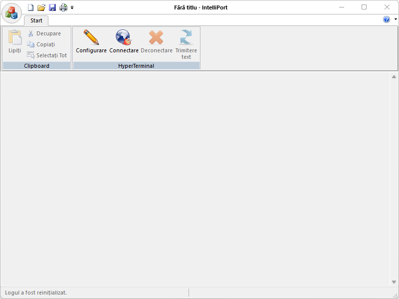
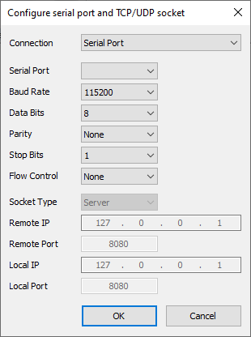

Download:
- [IntelliPortSetup.msi](https://www.moga.doctor/freeware/IntelliPortSetup.msi)
- [IntelliPort.zip](https://www.moga.doctor/freeware/IntelliPort.zip)

## Introduction

_IntelliPort_ is a free (as in “free speech” and also as in “free beer”) serial port / socket logger. Running in the Microsoft Windows environment, its use is governed by [GNU General Public License v3.0](https://www.gnu.org/licenses/gpl-3.0.html). _IntelliPort_ is written in C++ and uses pure Win32 API and STL which ensures a higher execution speed and smaller program size. By optimizing as many routines as possible without losing user friendliness, _IntelliPort_ is trying to reduce the world carbon dioxide emissions. When using less CPU power, the PC can throttle down and reduce power consumption, resulting in a greener environment. I hope you enjoy _IntelliPort_ as much as I enjoy coding it!

_IntelliPort_ is a program that you can use to connect to other computers, using either your null modem cable or Ethernet connection. _IntelliPort_ records the messages passed to and from the computer on the other end of your connection. Therefore, it can serve as a valuable troubleshooting tool when setting up and using your modem. To make sure that your modem is connected properly or to view your modem’s settings, you can send commands through _IntelliPort_ and check the results. _IntelliPort_ has scroll functionality that allows you to look at received text that has scrolled off the screen. You can use _IntelliPort_ to transfer large files from a computer onto your portable computer using a serial port rather than going through the process of setting up your portable computer on a network. _IntelliPort_ is designed to be an easy-to-use tool and is not meant to replace other full-feature tools available on the market. You can use _IntelliPort_ to perform the specific tasks described above, but do not attempt to use _IntelliPort_ for more complex communication needs.

## Getting started

### Install IntelliPort using the installer

- Download the installer
- Run the executable binary and follow the installation flow

The installer will likely require Administrative privileges in order to install _IntelliPort_ (and later, to update _IntelliPort_ or install or update plugins, or anything else that requires writing to the installation directory). If you do not have Administrative privileges, you either need to tell the installer to use a location where you do have write permission (though that may still ask for Administrator privileges), or you may choose not use the installer and instead run a portable edition from a directory where you have write permission.

### Install IntelliPort from zip

These instructions will allow you to run a portable or mini-portable (also called “minimalist”), without requiring administrative privileges.

- Create a new folder somewhere that you have write-permission
- Unzip the content into the new folder
- Run _IntelliPort_ from the new folder

The portable zip edition of _IntelliPort_ can be removed by deleting the directory they came in. If you manually set up file associations or context-menu entries in the OS, it is your responsibility to remove them yourself.

## Working with Files

A “file” is the basic unit of what is edited in _IntelliPort_, but that term actually covers multiple related concepts. Primarily, the “file” is the series of bytes stored on a disk or other storage medium and accessed through your computer’s filesystem; and pedantically, if the document you are editing has never been saved to the filesystem, it’s not technically a file, though common usage applies that term to unsaved documents as well. The “document” refers to the text being edited, whether it’s a new, unsaved document, or whether it’s a document that’s been previously saved as a file on the filesystem. And finally, in _IntelliPort_, each document is presented in a Tab in one of the two Views of the _IntelliPort_ user interface, which are the graphical containers which _IntelliPort_ uses to manipulate files and other documents, though many users think of the user interface element as the “file” as well.

The **main button** contains many of the normal file-operation actions found in most applications. _IntelliPort_ also includes other custom actions which are useful to understand.

- **New**: Creates a new document, and displays that empty document in a Tab in the active View.
- **Open**: Opens an existing file from the filesystem, and displays that document in a Tab in the active View.
- **Save**: Saves the current document to the filesystem using the same filename. 
 If the document does not currently have a file associated with it, this action will be grayed out and the menu entry cannot be used. Use **Save As** instead.
- **Save As**: Saves the current document to the filesystem, prompting for the new filename to use. 
 If the document had previously been saved to a file, this will create as new copy of the file, and _IntelliPort_ will continue working with the document associated with the new file, leaving the old file with the contents that were last saved.
- **Close**: Closes the active document, prompting to save if it has been modified since it was opened or created.
- The **Print** action will pull up a Windows-standard print dialog, from which you can choose your printer and send your text to the selected printer. 
 Normally, it will print the whole document, but you can use the print dialog to choose only certain pages; if you have an active selection in the editor, only the selected text will be printed.
- **Exit**: Closes the _IntelliPort_ application.

The **Clipboard** menu features typical editing commands which any Windows user should be familiar with:

- **Cut**: will remove any selected text from the document and place it on the Windows clipboard.
- **Copy**: will put a copy of any selected text on the Windows clipboard; document content is unaltered.
- **Paste**: if the Windows clipboard contains text, this will insert a copy of that text at the point of the caret; if text is selected when this command is executed, the selected text will be replaced by the text from the clipboard; if the clipboard does not contain text, nothing will happen.
- **Delete**: will remove any selected text from the document.
- **Select All**: selects all text in the document into a stream selection.

Configure serial port and TCP/UDP socket dialog

The **HyperTerminal** menu features the application's most important functions:

- **Configure**: allows either serial port or TCP/UDP socket configuration for _IntelliPort_.
- **Connect**: creates the remote connection using the current configuration.
- **Disconnect**: closes the remote connection.
- **Send Text**: sends text to remote connection.

## Create and Submit your Pull Request

As noted in the [Contributing Rules](https://github.com/mihaimoga/IntelliPort/blob/main/CONTRIBUTING.md) for _IntelliPort_, all Pull Requests need to be attached to a issue on GitHub. So the first step is to create an issue which requests that the functionality be improved (if it was already there) or added (if it was not yet there); in your issue, be sure to explain that you have the functionality definition ready, and will be submitting a Pull Request. The second step is to use the GitHub interface to create the Pull Request from your fork into the main repository. The final step is to wait for and respond to feedback from the developers as needed, until such time as your PR is accepted or rejected.
